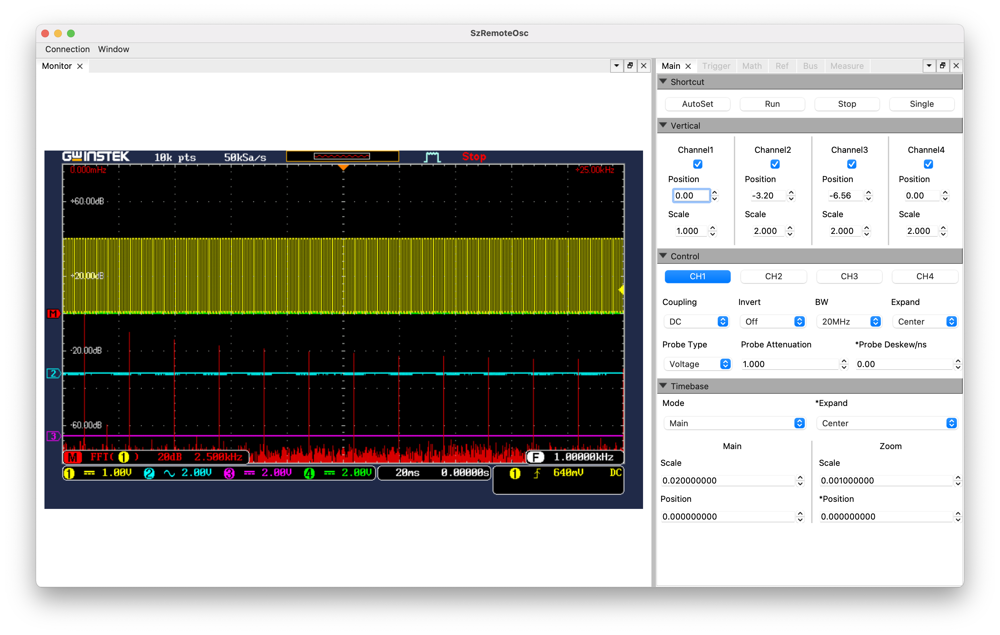

# SzRemoteOsc
SzRemoteOsc assists you use your GW Instek Oscilloscope more confident.



**Please note this project is still at an early stage, please use with care. Hope it will be helpful**

## Deploy
Require Anaconda installed, run 

```
conda create -y --name gwinstek python=3.7
conda activate gwinstek
conda install -y -c conda-forge pyqtads
pip install opencv-python pyvisa pyvisa-py 
```

## Contribute
Only necessary components are implemented, feel free to contribute
